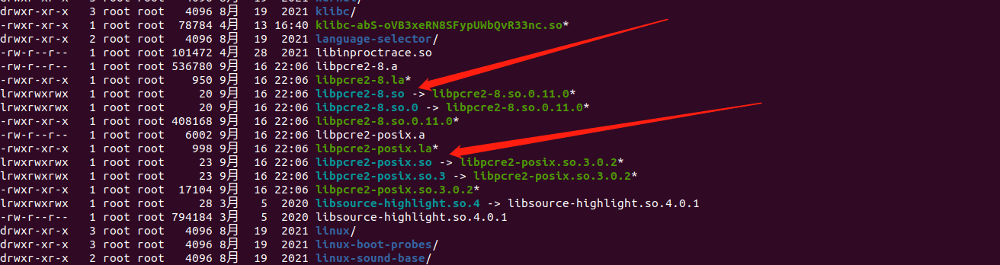
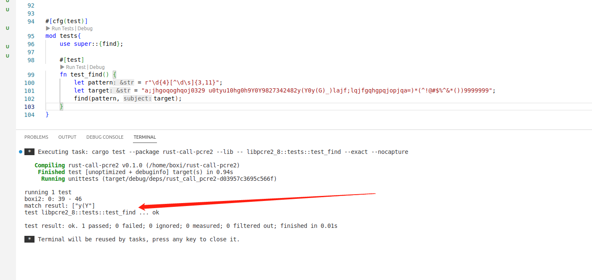
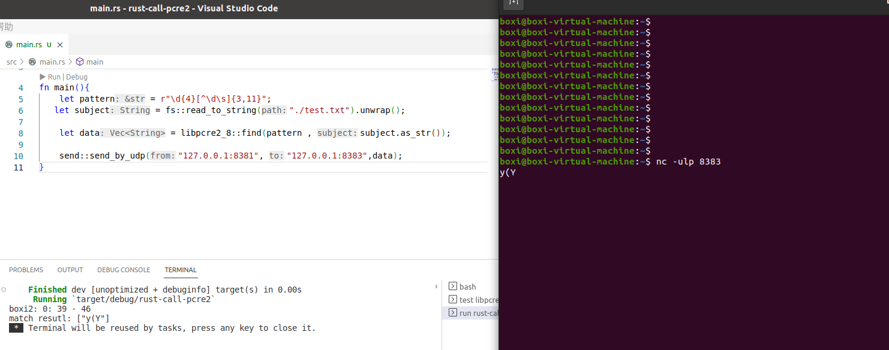

# rust-call-pcre2


## rust ffi 编程实战

### rust社区中的ffi教程 - 手动绑定C库

https://rustcc.cn/article?id=c39d7c1f-34bd-4e99-9752-28271cc733ac

https://github.com/lesterli/rust-practice/tree/cc99574ef2152684e996c5dead594eeb7224f431/ffi


### 官方给出的ffi编程示例

https://doc.rust-lang.org/nomicon/ffi.html

### other

- https://blog.csdn.net/qq_25490573/article/details/114779125

- https://github.com/alexcrichton/rust-ffi-examples


总结：将c编译成动态库，然后使用`#[line(lib_name)]`绑定


那么思路有了： 将 pcre2编译成动态库，然后链接到rust程序中。


## PCRES使用

### 编译

http://blog.fpliu.com/it/software/pcre2/build-for-current-host

编译过程， 下面命令可以无脑敲:
```
# 下载prce2
git clone https://github.com/PCRE2Project/pcre2.git
cd pcre2

# 创建编译目录
mkdir build && cd build

# 运行配置文件
../configure --prefix=/usr CFLAGS='-O2 -v'

# 编译
make

# 安装
make install
```

安装成功如图，相关的库安装在`/usr/lib`目录下：



### 使用

api:

https://pcre2project.github.io/pcre2/doc/html/pcre2api.html

api 非常之多，逐一暴露不太现实。

prce2 提供了一个demo的例子，显然我们可以参考demo调用了那些函数，我就链接使用那些。

demo例子在同级目录下，查看。


## 正则

工具： https://regex101.com/r/OCWxHr/1

## udp

netcat 监听
```bash
nc -ulp port
```


## 结果展示

测试结果



监听结果
